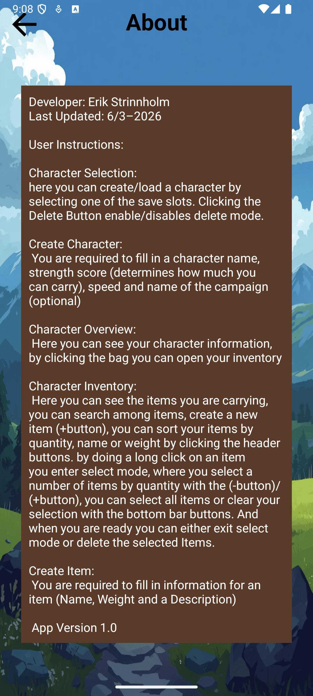
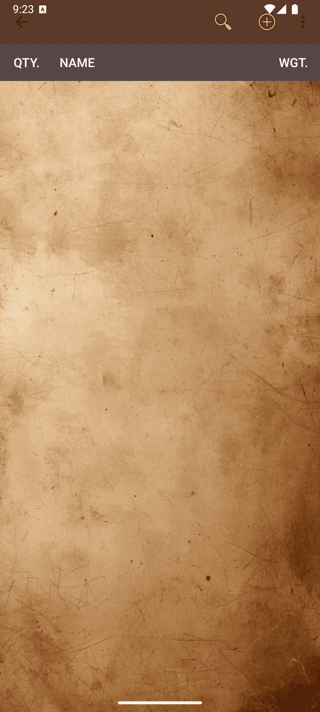
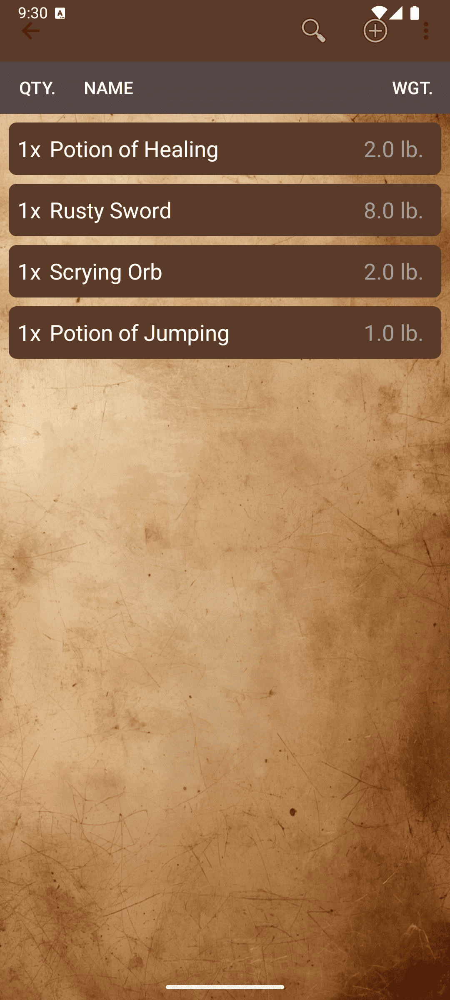
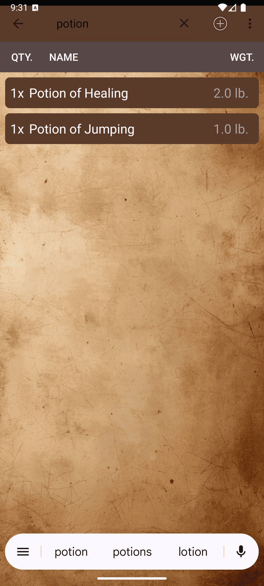
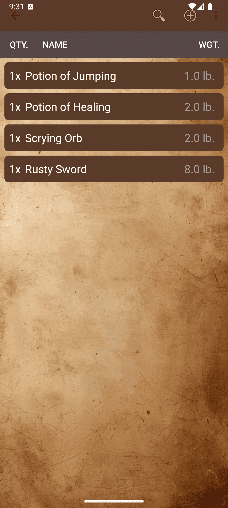
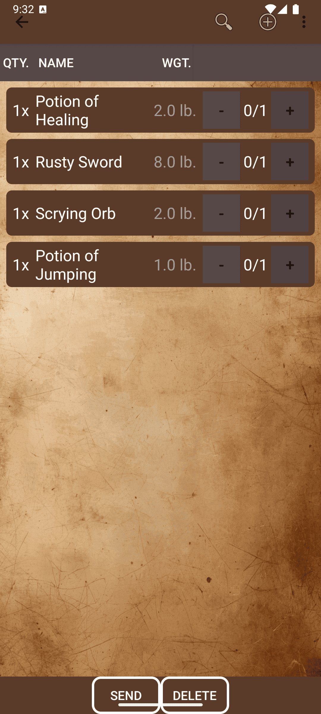
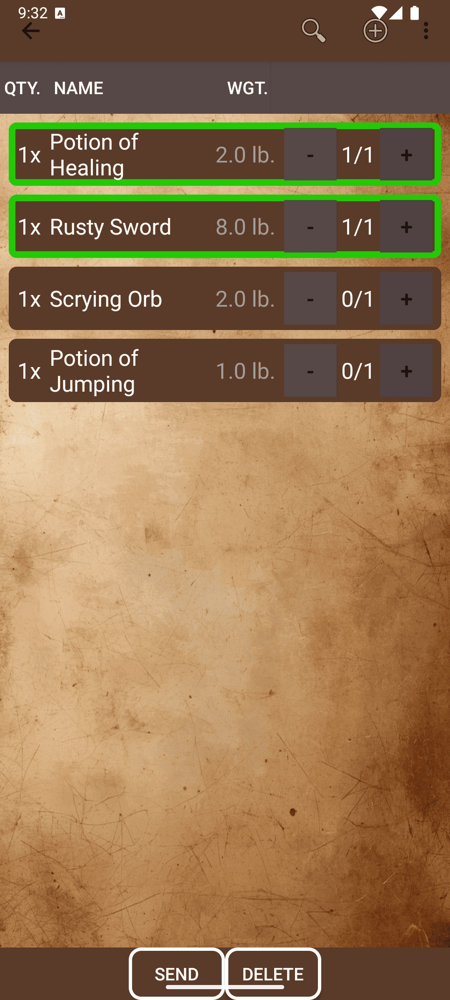
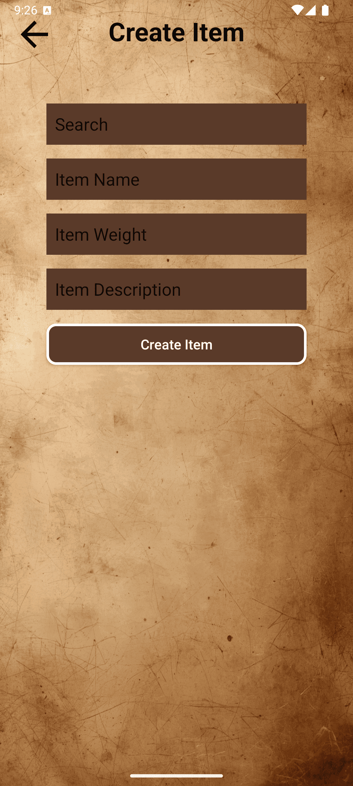
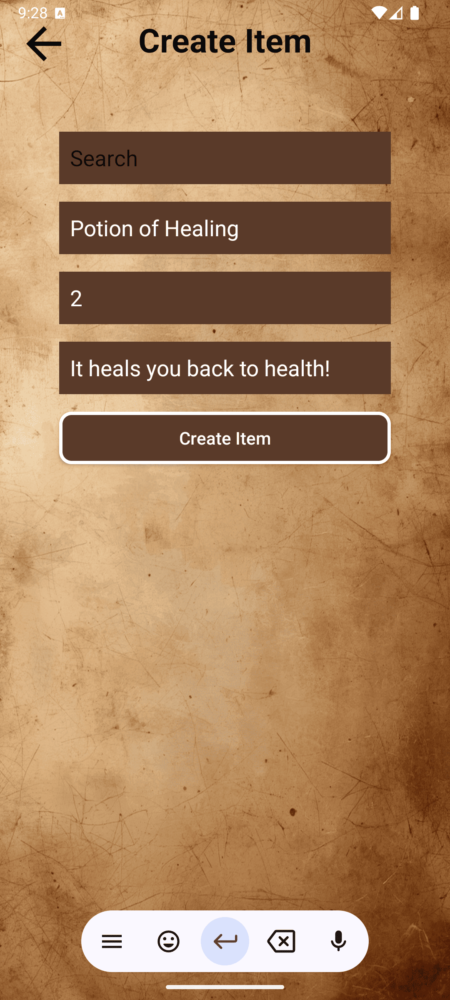

# RPG-Inventory-App
**Platform:** Android

## Overview
### Start Screen

### About Screen

### Select Character Screen

  
  

### Create Character Screen

  
  

### Character Overview Screen

### Inventory Screen
#### See Saved Items

  
  

#### Search Items

#### Sort Items

#### Select Items

  
  

#### Create Item Screen

  
  

